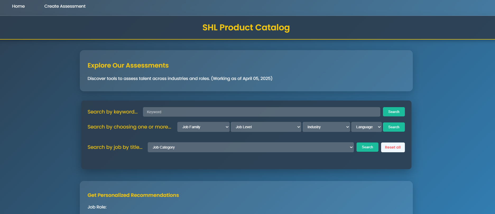
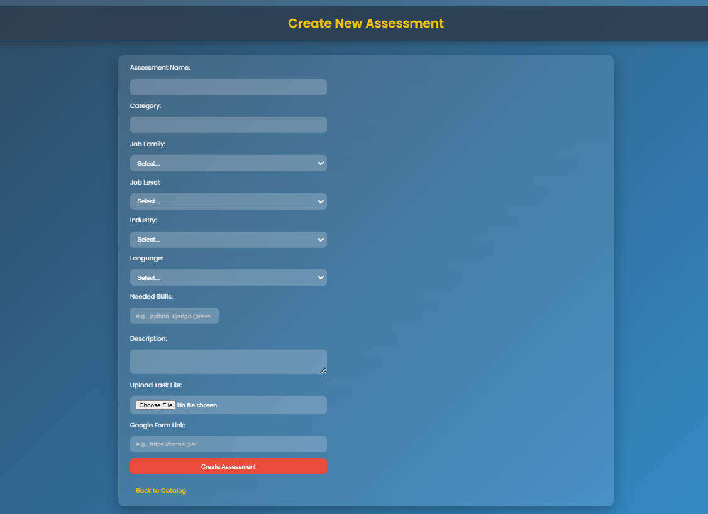
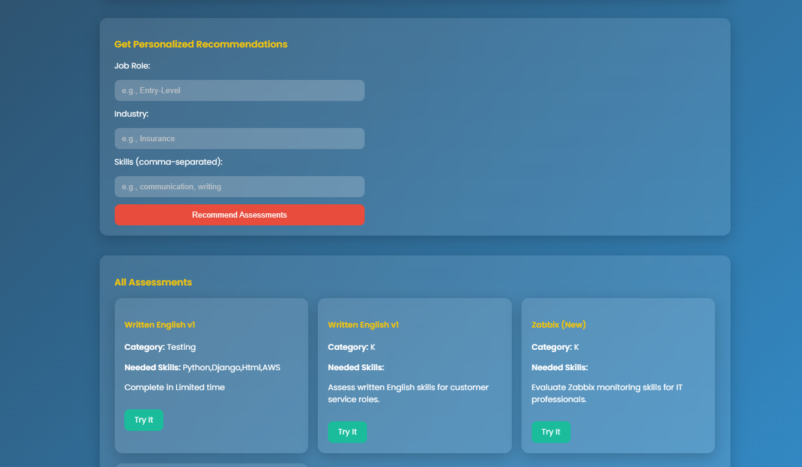
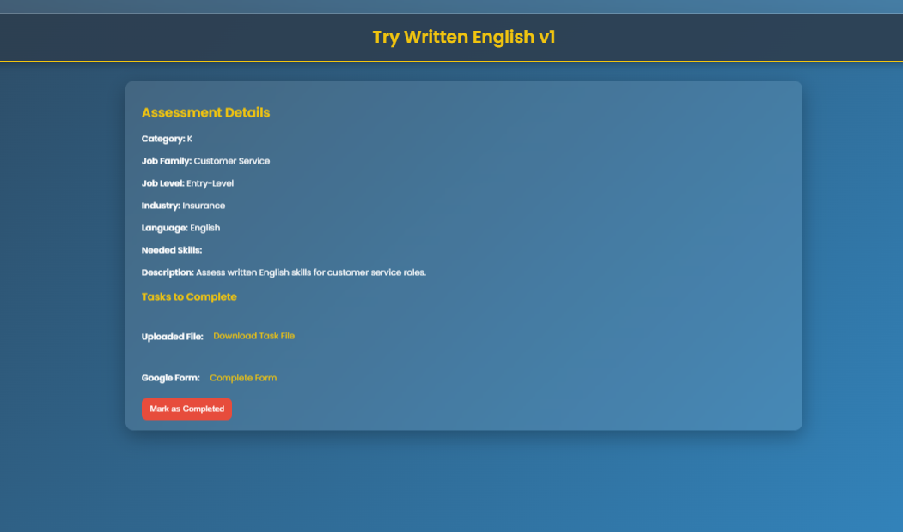

# 🚀 **SHL Assessment Recommendation Engine**

## 🖼️ Screenshots

<table>
  <tr>
    <td></td>
    <td></td>
  </tr>
  <tr>
    <td></td>
    <td></td>
  </tr>
</table>

**SHL Assessment Recommendation Engine** is a Django-powered web application inspired by SHL’s talent assessment catalog. It allows users to browse a comprehensive list of assessments, filter them by category, and get personalized recommendations based on job role, industry, and skills. Additionally, users can create custom assessments with detailed fields to expand the catalog dynamically.

---

## 🎯 **Key Features**

### 1️⃣ **Assessment Catalog**
- Browse a full list of SHL-inspired assessments (e.g., Verify G+, OPQ, Coding Simulation).
- View assessments organized by categories like "Ability & Aptitude," "Personality & Behavior," and "Knowledge & Skills."

### 2️⃣ **Personalized Recommendation Engine**
- Input job role (e.g., Developer), industry (e.g., Tech), and skills (e.g., coding, problem-solving).
- Receive tailored assessment suggestions based on your criteria.

### 3️⃣ **Create Custom Assessments**
- Add new assessments with fields:
  - **Job Family**: Choose from options like Business, Information Technology, Sales, etc.
  - **Job Level**: Select from Director, Entry-Level, Manager, etc.
  - **Industry**: Options include Banking/Finance, Healthcare, Tech, etc.
  - **Language**: Select from a list of languages (e.g., English, Spanish, Hindi).
  - **Skills**: Add multiple skills with a dynamic tag system (removable via a cross mark).
  - **Description**: Provide a detailed overview of the assessment.

### 4️⃣ **Responsive Design**
- Clean, modern UI inspired by SHL’s branding with a blue-and-white color scheme.
- Grid-based layout for assessment cards, optimized for all devices.

---

## 📚 **System Architecture**
```bash
shl_product_catalog/
├── manage.py
├── shl_product_catalog/
│   ├── init.py
│   ├── settings.py
│   ├── urls.py
│   ├── wsgi.py
│   └── asgi.py
├── catalog/
│   ├── init.py
│   ├── admin.py
│   ├── apps.py
│   ├── migrations/
│   ├── models.py
│   ├── tests.py
│   ├── urls.py
│   ├── views.py
│   └── static/
│       └── catalog/
│           ├── css/
│           │   └── styles.css
│           └── js/
│               └── scripts.js
│   └── templates/
│       └── catalog/
│           ├── catalog_home.html
│           ├── create_assessment.html
│           └── recommendation_result.html
└── requirements.txt
```


---

## 📄 **Installation and Setup**

### 1. Clone the Repository
```bash
git clone https://github.com/yourusername/shl-assessment-recommendation.git
cd shl-assessment-recommendation
```
## 2.Create and Activate Virtual Environment

```bash
python3 -m venv venv
source venv/bin/activate   # For Linux/Mac
# OR
venv\Scripts\activate      # For Windows
```

## 3. Install Required Dependencies

```bash
pip install -r requirements.txt
```

## 4.Apply Migrations
```bash
python manage.py makemigrations
python manage.py migrate
```

## 5. Run the Application

```bash
python manage.py runserver
```

## 📊 **Recommendation Engine Workflow**

1. **User Input**  
   Users enter their **job role**, **industry**, and **skills** through an intuitive recommendation form.

2. **Data Matching**  
   Inputs are matched against assessment fields like **job level**, **industry category**, and **skills** stored in the database.

3. **Output**  
   Matched assessments are displayed in a **card-based layout** for easy visualization and access.

---

## 📚 **Project Workflow**

### 🗂️ **Catalog Design**
- Recreated SHL’s product catalog structure.
- Organized assessments by category and visualized with product-style cards.

### 🧠 **Recommendation Logic**
- Developed a **rule-based engine** to match user inputs to predefined assessment fields.
- Ensured high relevance using multi-tagged skill matching and industry filters.

### ✍️ **Assessment Creation**
- Implemented a **dynamic form** to add custom assessments.
- Integrated **multi-select dropdowns** and **tag inputs** for skills and attributes.

### 💻 **Frontend Development**
- Built a responsive interface using **HTML**, **CSS**, and **JavaScript**.
- Ensured mobile and desktop compatibility with smooth interactivity.

---

## 🛠️ **Tech Stack**

- **Frontend:** HTML, CSS, JavaScript  
- **Backend:** Python, Django  
- **Database:** SQLite / PostgreSQL  
- **Authentication:** Django Auth  
- **Form Enhancements:** Select2, Tagify, jQuery  

---
